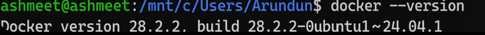
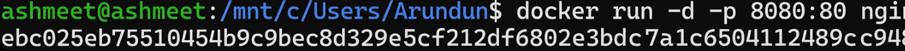
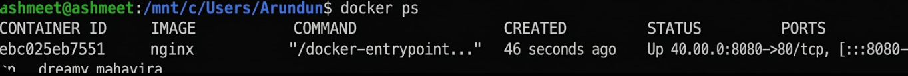
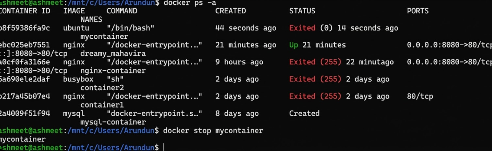
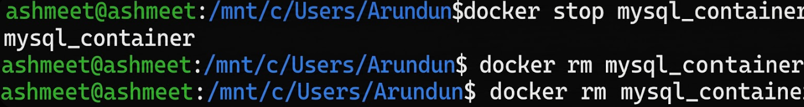
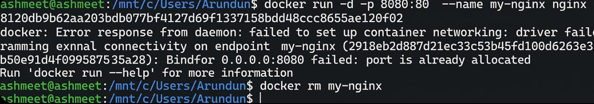

# 🐳 Lab 2 – Docker Installation, Configuration, and Running an Image

## 📖 Experiment 2
This experiment demonstrates how to pull a Docker image, run a container with port mapping, and perform container lifecycle operations.

---

## 🎯 Objective
- Pull an image from Docker Hub  
- Run and manage a container  
- Perform Docker lifecycle commands  

---

## 🛠️ Prerequisite

Check Docker installation:

```bash
docker --version
```

---

## 🚀 Procedure

### 1️⃣ Pull Docker Image

```bash
docker pull nginx
```

### 📸 Output


---

### 2️⃣ Run Container with Port Mapping

```bash
docker run -d -p 8080:80 nginx
```

Open in browser:

http://localhost:8080

### 📸 Output


---

### 3️⃣ Verify Running Containers

```bash
docker ps
```

### 📸 Output


---

### 4️⃣ Stop the Container

```bash
docker stop <container_id>
```

### 📸 Output


---

### 5️⃣ Remove the Container

```bash
docker rm <container_id>
```

### 📸 Output


---

### 6️⃣ Remove the Image

```bash
docker rmi nginx
```

### 📸 Output


---

## 📊 Result
Docker images were successfully pulled, containers were executed, and lifecycle commands were performed successfully.

---

## 📚 Key Commands Summary

| Command | Description |
|---------|------------|
| `docker --version` | Check Docker version |
| `docker pull nginx` | Download image |
| `docker run -d -p 8080:80 nginx` | Run container |
| `docker ps` | List running containers |
| `docker stop <id>` | Stop container |
| `docker rm <id>` | Remove container |
| `docker rmi nginx` | Remove image |

---

## 👨‍💻 Author
**Aditya Sharma**
